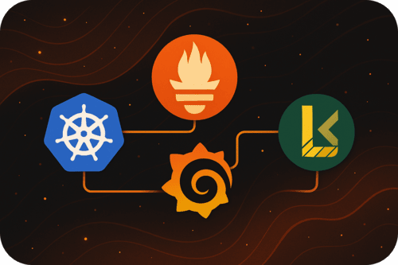

<div align="center">
<br/>
<h1>LGTM Monitoring Stack</h1>
</div>

A simple example deployment of the LGTM monitoring stack (Loki, Grafana, Tempo, Metrics) using Helm charts and Kubernetes manifests.

## Overview

This repository contains a minimal implementation of a monitoring stack focused on **Loki** and **Grafana** deployment. It serves as a learning project to understand and practice:

- **Helm** chart development and management
- **Kustomization** manifests for Kubernetes deployments
- **LGTM stack** components and their integration

## Goals

The primary objectives of this project are:

1. **Learn Helm**: Understand how to create, structure, and manage Helm charts for Kubernetes deployments
2. **Practice Kustomization**: Get hands-on experience with Kustomize for managing Kubernetes manifests
3. **Explore LGTM Stack**: Gain familiarity with the modern observability stack:
   - **L**oki (log aggregation)
   - **G**rafana (visualization and dashboards)
   - **T**empo (distributed tracing) - _planned_
   - **M**etrics (Prometheus-based metrics collection) Mimir is also planned

## Architecture

This deployment includes:

- **Grafana**: Visualization and dashboard platform
- **Loki**: Log aggregation system
- **Prometheus**: Metrics collection and storage
- **Node Exporter**: Host metrics collection
- **Kube State Metrics**: Kubernetes cluster metrics
- **Promtail**: Log shipping agent for Loki

## Project Structure

```
.
├── LICENSE
├── README.md
└── chart/
    ├── Chart.yaml              # Helm chart metadata
    ├── values.yaml             # Default configuration values
    ├── rbac/                   # RBAC configurations
    │   ├── kube-state-metrics.yaml
    │   ├── prometheus.yaml
    │   └── promtail.yaml
    └── templates/              # Kubernetes manifest templates
        ├── grafana.yaml
        ├── kube-state-metrics.yaml
        ├── loki.yaml
        ├── node-exporter.yaml
        ├── prometheus.yaml
        └── promtail.yaml
```

## Getting Started

### Prerequisites

- Kubernetes cluster (local or remote)
- Helm 3.x installed
- kubectl configured to access your cluster

### Deployment

1. Clone the repository:
   ```bash
   git clone https://github.com/Kobusvdwalt/lgtm.git
   cd lgtm
   ```

2. Deploy using Helm:
   ```bash
   helm install lgtm ./chart
   ```

3. Access Grafana:
   ```bash
   kubectl port-forward svc/grafana 3000:3000
   ```
   
   Open http://localhost:3000 in your browser.

### Customization

Modify `chart/values.yaml` to customize the deployment according to your needs. You can override default values during installation:

```bash
helm install lgtm ./chart --set grafana.adminPassword=yourpassword
```

## Learning Resources

This project was built while learning from various resources about:

- [Helm Documentation](https://helm.sh/docs/)
- [Kustomize Documentation](https://kustomize.io/)
- [Grafana Documentation](https://grafana.com/docs/)
- [Loki Documentation](https://grafana.com/docs/loki/)
- [Prometheus Documentation](https://prometheus.io/docs/)

## Contributing

This is primarily a learning project, but contributions and improvements are welcome! Feel free to:

- Report issues
- Suggest improvements
- Submit pull requests
- Share feedback

## License

This project is licensed under the terms specified in the [LICENSE](LICENSE) file.

## Acknowledgments

This project is inspired by the need to understand modern observability practices and the LGTM stack in a hands-on, practical way.